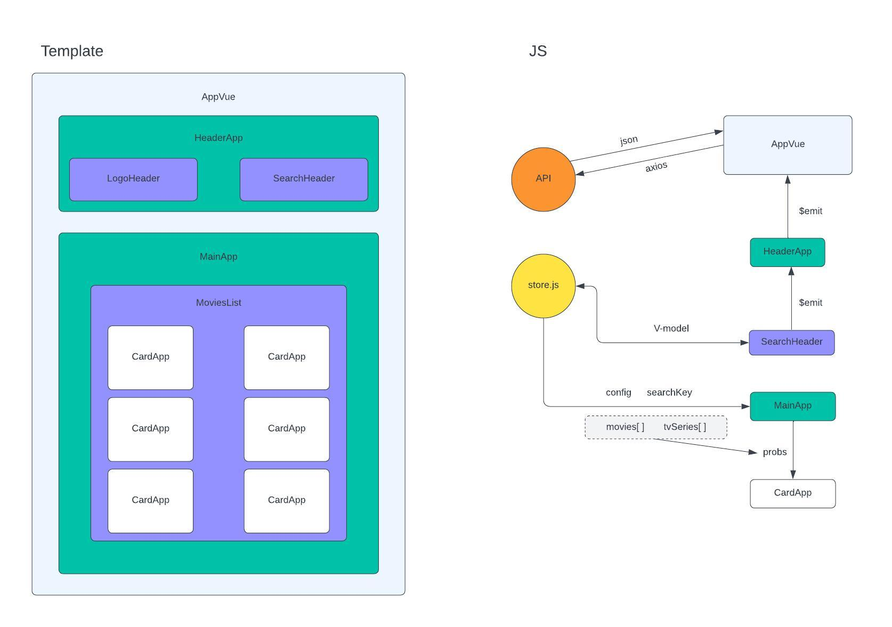

# BoolFlix
```
Per installare il progetto:
- npm install
- npm run dev
```
In questo esercizio iniziamo a replicare la logica che sta dietro a tantissimi siti che permettono la visione di film e telefilm.
Per fare questo utilizzeremo un API che ci permette di avere un insieme di risultati congrui alla nostra ricerca.



## Milestone 0:
Progettare la struttura del global state.

## Milestone 1:

Creare un layout base con una searchbar (una input e un button) in cui possiamo scrivere completamente o parzialmente il nome di un film. 
***
Cliccando il bottone o cliccando invio, cercare sull’API tutti i film che contengono ciò che ha scritto l’utente.
Vogliamo dopo la risposta dell’API visualizzare a schermo i seguenti valori per ogni film trovato: 
- Titolo
- Titolo Originale
- Lingua
- Voto

## Milestone 2:
Trasformiamo la stringa statica della lingua in una vera e propria bandiera della nazione corrispondente, gestendo il caso in cui non abbiamo la bandiera della nazione ritornata dall’API.
***
Allarghiamo poi la ricerca anche alle serie tv. Con la stessa azione di ricerca dovremo prendere sia i film che corrispondono alla query, sia le serie tv, stando attenti ad avere alla fine dei valori simili.

# Milestone 3:
Aggiungiamo la copertina del film o della serie al nostro elenco. Ci viene passata dall’API solo la parte finale dell’URL.
***
Trasformiamo poi il voto da 1 a 10 decimale in un numero intero da 1 a 5, così da permetterci di stampare a schermo un numero di stelle piene che vanno da 1 a 5, lasciando le restanti vuote, arrotondando sempre per eccesso all’unità successiva

# Milestone 4:
Creando un layout completo simil-Netflix:
Un header che contiene logo e search bar.
Dopo aver ricercato qualcosa nella searchbar, i risultati appaiono sotto forma di “card” in cui lo sfondo è rappresentato dall’immagine di copertina.
Andando con il mouse sopra una card, appaiono le informazioni aggiuntive già prese nei punti precedenti più la overview

